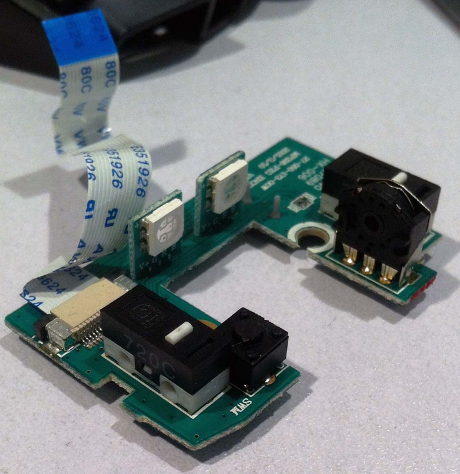
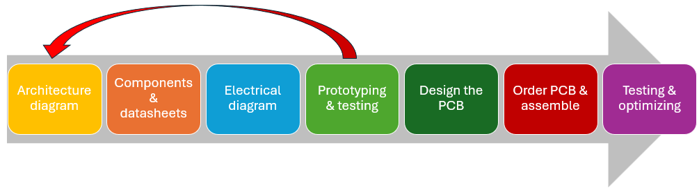

# Introduction

Printed Circuit Boards (PCBs) form the backbone of all major electronic devices, from the simplest gadgets to the most complex systems. We are often surrounded by them without realizing it. As I sit at my desk writing this course and look around, I can see PCBs in my calculator, smartphone, smartwatch, keyboard, mouse, monitor, headset, controller, and several in my desktop computer. And that’s just what’s on my desk! PCBs come in all sizes and shapes, ranging from very simple to highly complex, and they power most of the devices we use.

Designing a PCB requires knowledge of electrical circuits, components, electronics, skill, and most importantly, experience. This last aspect can be challenging in an educational context, as you truly learn how to design PCBs through hands-on practice. Nonetheless, in this course, along with knowledge from other courses, you will acquire the basic understanding and skills needed to develop PCBs.

The process of designing a PCB involves the following steps:

1. Drawing an architecture diagram.
2. Creating an electrical diagram from the architecture diagram using the information from the datasheets of the chosen components.
3. Testing parts or the entire electrical diagram by making prototypes, testing functionality, and measuring currents, voltages, and signal waveforms.
4. Revising the architecture diagram and electrical diagram if needed.
5. Designing the PCB.
6. Ordering and assembling the PCB.
7. Testing the PCB for functionality and taking measurements.
8. Creating a new optimized version if necessary.

