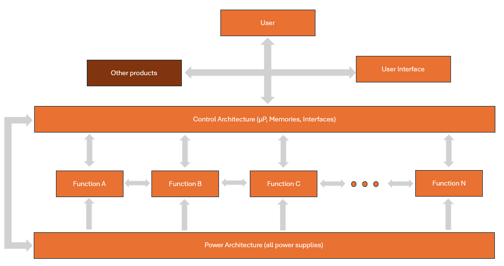

# Electrical diagram

Before diving into PCB design, it's essential to discuss the broader context, particularly **Product Design**. We need to understand whether a PCB is necessary and, if so, what functions and components it will require. A PCB is essentially a carrier for components, albeit a crucial one, and is only a part of the entire design process.

When developing a product, it’s important to identify the **functions** the product must fulfill. These functions can range from something as simple as analog-to-digital conversion to something as complex as an automobile. For complex functions, we break them down into smaller sub-functions, and if necessary, further divide these into more manageable sub-sub-functions, and so on.

To maintain clarity and avoid excessive subdivisions, we use a hierarchical terminology: **system** at the highest level, **product** at the next level, followed by **module**, and finally **function** at the lowest level. A function consists of **components**.

We continue breaking down the hierarchy until we have enough detail to work concretely with components, modules, products, or systems to achieve the desired function.

It's important to note that these terms are flexible depending on your perspective. For example, what one car assembly plant calls a component might be considered a complete system by the supplier.

Therefore, we will use the terms function, product, module, and system somewhat interchangeably. Always pay close attention to the context. The good news is that each level is structurally similar, making it easy to combine functions and upgrade them to modules or products.

## Functions

Every function essentially has an **input** and an **output**. The function is responsible for correctly **converting** the input into the desired output. Note that there can be multiple inputs and multiple outputs. This can be achieved with a single function or several functions working together, as explained above.

Also, some inputs and outputs are inherent to the product itself. For example, consider a game controller. Inputs include button presses, joystick movements, and trigger pulls, while outputs might include haptic feedback and LED indicators. The device must therefore provide the necessary inputs (such as buttons and joysticks) and outputs (such as haptic motors and LEDs). The input elements are integral parts of the product.

The boundaries of function realization at the input and output can shift depending on what is desired and the degree of desired integration of the product. For instance, do we really want an integrated haptic feedback system or just a simple button press registration?

These types of small changes can have a significant impact on product realization.

Therefore, it is extremely important to clearly define the inputs and outputs, as well as the functions themselves, to avoid misunderstandings later on. A game controller is not the same as a console, even though it performs a crucial role in the overall gaming experience.

## Requirements 

Good and accurate detailing of input and output is crucial for finding the right solution. The more details you have, the more accurate and precise the solution will be. It is important to regularly test and validate this list with stakeholders.

Be cautious of **Feature Creep**, where new elements are constantly being added as input or output under the guise of *clarifications*.

We can divide functions and their associated requirements into two groups:

**Direct Functions – Functional Requirements**

These create a direct link between input and output and are typically commercial in nature. These are **Functional Requirements**, which are requirements the product must meet functionally. For example, creating an audio amplifier with 2 inputs and a 2x50W output.

**Indirect Functions – Non-Functional Requirements**

Indirect functions support and enhance direct functions. Examples include a power supply or mechanical housing, which may also be defined by maximum size, among other parameters. Additionally, factors such as safety, EMC, legal requirements (often varying by country/region), environment, and lifespan fall under this category. These indirect functions are often assumed but are not always clearly defined or remembered. These can also be considered inputs or outputs. The better they are defined, the better the final product will be. They are also called **Functional (non-commercial) Requirements** and often serve as preconditions for the functions and the product.

**Note**

Non-functional requirements, which are generally valid for various purposes, are often separated and listed independently. This is because specific teams, usually part of a **Quality** and/or **Reliability** Team, have the knowledge and skills to monitor and follow up on these requirements, especially legal ones.

## Architecture

If we examine a product or function closely, we notice a consistent design pattern in modern electronics. Thanks to the digital revolution and the advanced integration and capabilities of microcontrollers and software, circuits are now built from standardized components. This evolution has led to a clear classification into various groups, including two special categories: Power and Control. These two functions represent an integration of the power and control aspects of each individual function, a step that was taken years ago.

### Power

Every electronic product, and therefore every electronic function, requires a power supply. This can come from the mains voltage (230V AC in Europe) without backup if the power fails, or from battery power. Although AC-derived DC voltage shares many similarities with battery supply, there are several crucial differences during normal operation:

* **Start-up and shutdown behavior**: A battery-powered device might start up only 1-2 times during its lifespan, whereas a mains-powered device may start up more frequently, even multiple times a day or an hour. Therefore, resetting must be handled differently, and certain components may always need to retain their properties under tension (e.g., GSM).
* **Power interruptions**: Battery-powered devices are rarely affected by power interruptions, although consideration must be given to the potential removal or intermittent contact of batteries (e.g., remote controls).
* **Power consumption**: Battery-powered devices typically consume less power and operate at lower supply voltages (e.g., 5V max), while 230V AC-powered devices may encounter large inrush currents and associated electromagnetic interference.

#### Hard vs. Soft Switch

Many 230V AC-powered devices are continuously under voltage, either fully or partially. Completely removing the voltage can be done via a hard ON/OFF switch or by unplugging the power cord.

In addition to a hard ON/OFF switch, often required by law, there is a **soft switch** controlled by a microprocessor. While the main components are disconnected from power, a small part of the circuits remains operational. This keeps the device **alive** to read its status, for example.

However, this involves significant power losses (converting 230V AC to 3.3V DC at a current of a few mA is inefficient). Some devices use a rechargeable battery that charges during normal operation with high efficiency. Once charged, the device switches off and runs entirely on battery power. If the battery voltage drops too much, the sub-circuit recharges the battery by switching on the 230V network, then disconnects again. This is particularly useful for devices with long off-modes compared to on-modes. Certain lighting units are a good example of this.

#### Interference

There is a good chance that the power supply is shared between different sub-functions. Drawing up a **power balance** is essential. Additionally, power supplies need to be sufficiently **decoupled** to prevent interference between modules and external functions.

### Control

Both the functions and the power supply need to be controlled and monitored. Previously, this was often done through direct interfaces, but now it is usually managed by a control architecture consisting of a microcontroller (µC) or microprocessor (µP) with associated memory and software.

The control is achieved using digital ON/OFF signals, such as ENABLE or RESET I/Os, and digital buses like I²C, SPI, or UART.

This control architecture also provides the User Interface (UI), which often includes a touch screen display, along with several physical buttons and switches. This forms the primary interface with the user.

It's important to note that not all sub-functions have a Control Interface, though it is typically desirable, such as with a RESET function.

## Documentation

